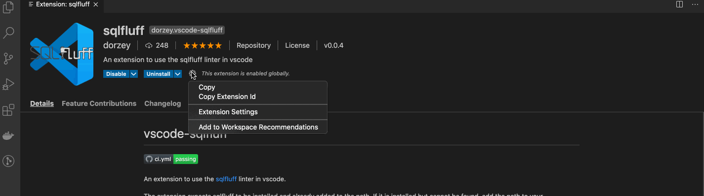

# vscode-sqlfluff


A linter and auto-formatter for [SQLFluff](https://github.com/alanmcruickshank/sqlfluff), a popular linting tool for SQL and dbt.


You can run [Format Document](https://code.visualstudio.com/docs/editor/codebasics#_formatting) to fix the linting violations. You cannot run Format Selection. Please note that not all linting violations are automatically fixable.

## Configuration

The extension expects sqlfluff to be installed and already added to the path. If it is installed but cannot be found, add the path to your preferences as seen below. Find the path by typing `which sqlfluff` into your terminal.

Edit your VS Code `settings.json` file either through the UI or by manually updating the file. The gif below shows the UI path.



If you want to manually update the `settings.json` file, open the VS Code command palette and type in `settings.json`. Select `Preferences: Open Settings`. Then, add the following two lines to `settings.json`.

```json
"sql.linter.executablePath": "<PATH_TO_YOUR_SQLFLUFF_FROM_WHICH_SQLFLUFF_COMMAND",
"sql.linter.run": "onType"
```

By default the linter will lint on the fly `"sql.linter.run": "onType"` but can be changed to linting as you save `"sql.linter.run": "onSave"`. Note that linting on save is most useful when auto-save is on.

### Format file

By default you will be able use SQLFluff fix your file by formatting. Same as calling `sqlfluff fix --force <path>`


## Credits / Links

- [dorzey](https://github.com/sqlfluff/vscode-sqlfluff)
- [VSCode's Extensions Samples](https://github.com/microsoft/vscode-extension-samples/tree/main/test-provider-sample)
- [VSCode's Testing Documentation](https://code.visualstudio.com/api/extension-guides/testing)

## License

The MIT License (MIT). Please see the [license file](LICENSE.md) for more information.
